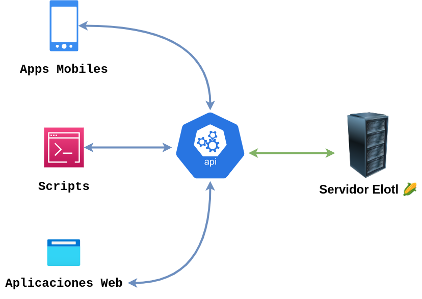
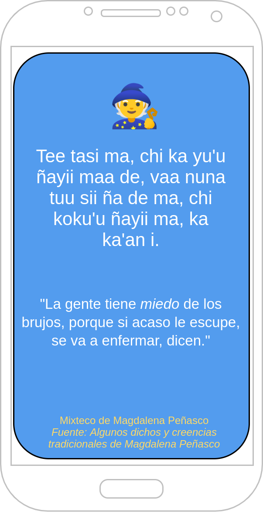
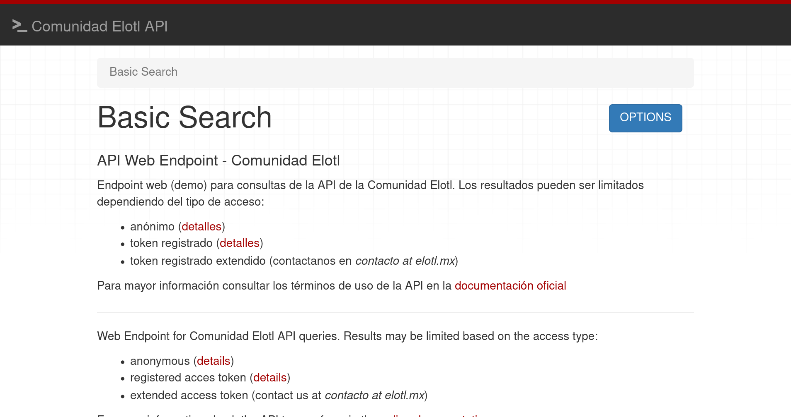
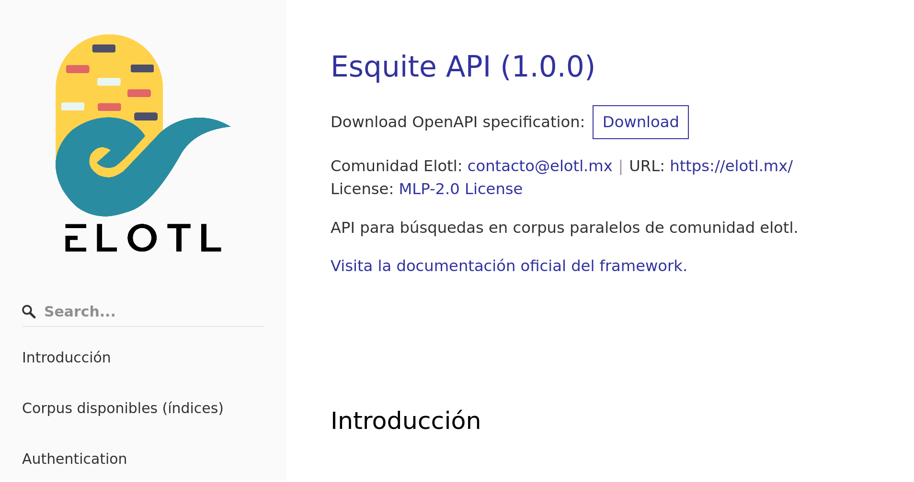
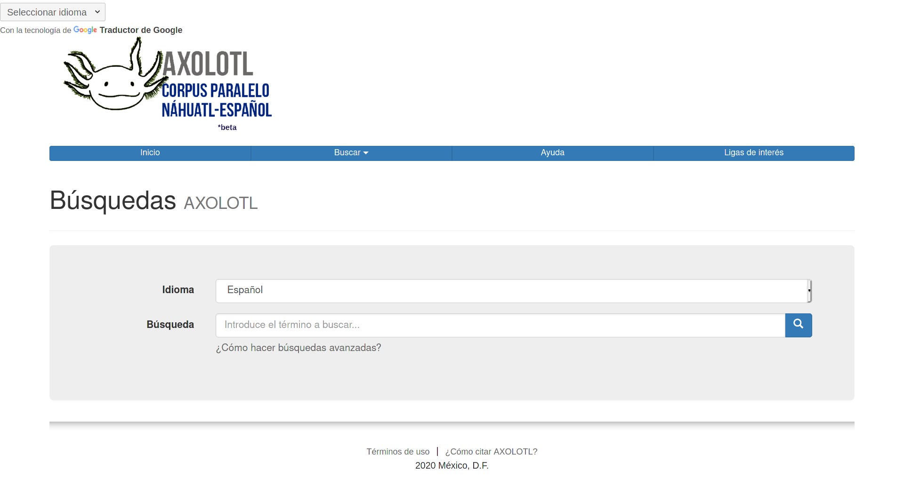
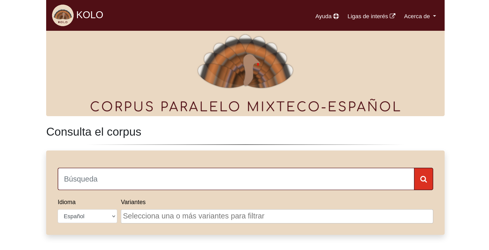
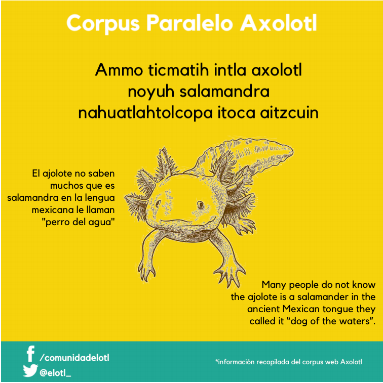

# ¿Qué es una API? y ¿Para qué se usan?

* API son siglas en inglés para *application programming interface*
* Conjunto de definiciones y protocolos que permiten la integración de
diferentes aplicaciones

{height=60%}

# Interface

* Una interface es una capa de abstracción

. . .

* Interactuar con un sistema sin la necesidad de entender como está hecho

. . .


* Las APIs permiten acceder a desarrolladoras a datos y funcionalidades de la
comunidad

. . .

* Solo necesitan saber cómo pedirle cosas (*requests*).

# Ejemplo

* Una aplicación movil que diario muestra una frase en mixteco

{height=80%}


# La API de Comunidad Elotl 

* Acceso a nuestros corpus paralelos de forma programática

. . .

* Búsquedas que hace Esquite por medio de código

. . .

* Con esto se simplifica el desarrollo de aplicaciones haciendolo más rápido,
barato y sencillo (en teoría :p). 

# APIs fántasticas y dónde encontrarla

**`https://api.elotl.mx/`**



# ¿Como usar la API de Comunidad Elotl?

Un punto de partida es la documentación

**`https://esquite.readthedocs.io/es/latest/api.html`**



# ¿Desde dónde puedo hacer mi consulta?

Hay diferentes formas de usar la API

* Desde Web

. . .

* Con un cliente

. . .

* Usando un lenguaje de programación (DEMO)

# ¿Como hacer consultas?

## Básica

```json
{
	"lang": "l1",
	"query": "niño",
	"index": "kolo-production"
}
```

## Con variantes

```json
{
	"lang": "l2",
	"query": "jamädi",
	"index": "tsunkua-production",
	"variants": ["ots", "ote"]
}
```

# ¿Como se ve la respuesta de datos?

```json
{
	"document_name": "Visión de los vencidos (hñahñu)",
	"pdf_file": "visiondelosvencidoshnahnu.pdf",
	"variant": "Otomí del Mezquital (ote)",
	"highlight": {
		"l2": [
				"Nu'i ri <em>jamädi</em> ya jä'i,"
		],
		"variant": [
				"<em>Otomí del Mezquital (ote)</em>"
		]
	},
	"l1": "Favorecido por la gente estás,",
	"l2": "Nu'i ri jamädi ya jä'i,"
}
```

# EsCLIte


# Otras formas de conseguir datos

## `py-elotl`

```python
print("Name\t\tDescription")
list_of_corpus = elotl.corpus.list_of_corpus()
for row in list_of_corpus:
    print(row)
```

```
Name		Description
['axolotl', 'Is a Spanish-Nahuatl parallel corpus']
['tsunkua', 'Is a Spanish-otomí parallel corpus']
```

## Axolotl

[](https://www.axolotl-corpus.mx/)

## Tsunkua

[](https://tsunkua.elotl.mx/)

## Kolo

[](https://kolo.elotl.mx/)

## Job

[](https://www.axolotl-corpus.mx/)

## Materiales didácticos

[{height=90%}](https://elotl.mx/proyectos/materiales-didacticos/)

## Contacto

* dbarriga at ciencias.unam.mx
* contacto at elotl.mx
* @elotlmx
* elotl.mx
* github.com/ElotlMX

# Recursos

* [Elotl](http://www.elotl.mx/) - *http://www.elotl.mx/*
  * [Repo Esquite](https://github.com/ElotlMX/Esquite/) - *https://github.com/ElotlMX/Esquite/*
  * [Repo modulo elotl](https://github.com/ElotlMX/py-elotl/) - *https://github.com/ElotlMX/py-elotl/*
  * [Tsunkua](https://tsunkua.elotl.mx/) - *https://tsunkua.elotl.mx/*
  * [Kolo](https://kolo.elotl.mx/) - *https://kolo.elotl.mx/*
  * [Axolotl](https://axolotl-corpus.mx/search/) - *https://axolotl-corpus.mx/search/*
  * [Materiales didácticos](https://elotl.mx/proyectos/materiales-didacticos/) - *https://elotl.mx/proyectos/materiales-didacticos/*

---
title: "Usando la API de Elotl para construir tus propias aplicaciones"
author: Diego A. Barriga (@umoqnier)
institute: Comunidad Elotl
theme: metropolis
colortheme: default 
date: "17 de Julio 2021"
navigation: horizontal
---
